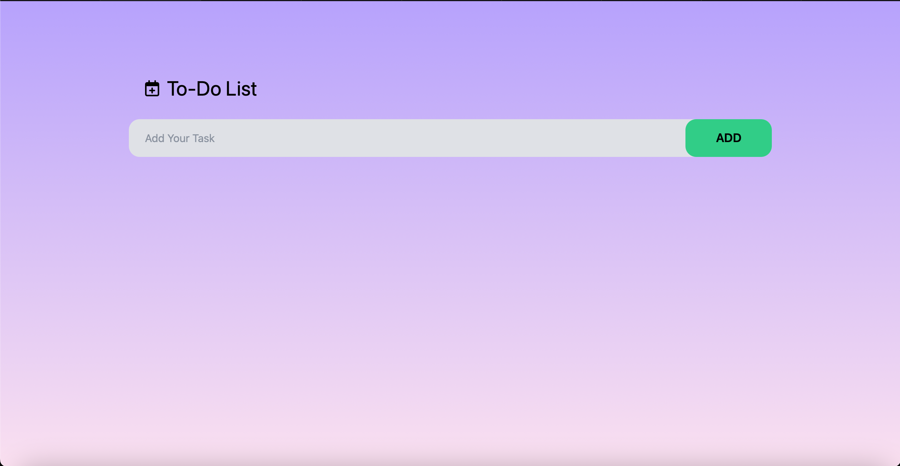

# To-Do List Application

A modern and responsive To-Do List application built with React.js and Tailwind CSS. This application allows users to manage their tasks with features like adding, toggling, and deleting tasks.

## Features
- Add new tasks.
- Mark tasks as complete or incomplete.
- Delete tasks.
- Data persistence using `localStorage`.
- User-friendly interface with FontAwesome icons and responsive design.

## Technologies Used
- **Frontend Framework:** React.js
- **State Management:** React `useState` and `useEffect`
- **Icons:** FontAwesome
- **Styling:** Tailwind CSS

## How to Run Locally
1. Clone this repository:
   ```bash
   git clone https://github.com/devopsenthusiastH/Project-ToDo-App.git
   ```
2. Navigate to the project directory:
   ```bash
   cd todo-list-react
   ```
3. Install the required dependencies:
   ```bash
   npm install
   ```
4. Start the development server:
   ```bash
   npm start
   ```
5. Open the application in your browser at `http://localhost:3000`.

## Screenshots
### Main UI


### Adding a Task


### Completed and Incomplete Tasks


## Future Enhancements
- Add categories for tasks.
- Implement drag-and-drop functionality.
- Add due date and reminder notifications.

## Contributing
Contributions, issues, and feature requests are welcome! Feel free to check the [issues page](https://github.com/devopsenthusiastH/todo-list-react/issues).

## License
This project is licensed under the [MIT License](LICENSE).

## Author
[Mutteshwar Nagappa Handibar](https://github.com/devopsenthusiastH)
